# 一、 语法
## 1. 标题
&emsp;&emsp;在想要设置为标题的文字前面添加井号（#） ，井号（#）的数量代表了标题的级别。

|   序号    |	说明    |   Markdown    |	HTML    |	预览效果    |
|-----------|-----------|-----------|-----------|-----------|
|   1   |   一级标题    |	`# 一级标题`    |   \<h1>一级标题\</h1> |	<h1>一级标题</h1>|
|   2   |   二级标题	|   `## 二级标题`   |   \<h2>二级标题\</h2> |	<h2>二级标题</h2>|
|   3   |   三级标题	|   `### 三级标题`	|   \<h3>三级标题\</h3> |	<h3>三级标题</h3>|
|   4   |   四级标题	|   `#### 四级标题`	|   \<h4>四级标题\</h4> |	<h4>四级标题</h4>|
|   5   |   五级标题	|   `##### 五级标题`|   \<h5>五级标题\</h5> |	<h5>五级标题</h5>|
|   6   |   六级标题	|   `###### 六级标题`|   \<h6>六级标题\</h6> |	<h6>六级标题</h6>|
## 2. 文本
|   序号	|   说明    |	Markdown    |	预览效果    |
|-----------|-----------|-----------|-----------|
|   1   |	斜体文本样式    |	`*斜体文本样式*`    | *斜体文本样式*    |
|   2	|	斜体文本样式    |	`_斜体文本样式_`    |	_斜体文本样式_    |
|   3	|	加粗文本样式    |	`**加粗文本样式**`    |	**加粗文本样式**    |
|   4	|	加粗文本样式    |	`__加粗文本样式__`    |	__加粗文本样式__    |
|   5	|	标记文本样式    |	`==标记文本样式==`    |	==标记文本样式==    |
|   6	|	删除文本样式    |	`~~删除文本样式~~`    |	~~删除文本样式~~    |
|   7	|	下标文本样式    |	`H~2~O 是液体`    |	H~2~O 是液体  |
|   8	|	上标文本样式    |	`2^10^ 运算结果是 1024`    | 2^10^ 运算结果是 1024   |

## 3. 图片

语法：``
>说明：图片Alt【在图片因某些原因不能显示时来替代显示的文字，不是必须】，图片Link【图片存储的地址链接】，图片Title【在鼠标悬停在图片上时显示的文字】。

## 4. 链接
#### （1）行内式
样例：[百度一下](www.baidu.com "测试链接")
语法：`[链接文字](链接地址 "title")`
>说明：[] 里面写链接文字，（） 里面写链接地址，在 （） 中可用为链接指定 title 属性【效果是鼠标悬停在链接上会出现指定的 title文字】。
#### （2）自动链接
样例：<https://www.baidu.com/>
语法：`<链接地址>`
>说明：只要用 <> 把网址或者邮箱地址包起来，就自动转成链接。网址前必须有 http:// 或 https://。

## 5. 目录
语法：`@[TOC](这里写目录标题)`
>说明：在短路中填写 @[TOC] 显示全文内容的目录结构，（） 里面写标题的显示样式。

生成目录的注意：  
1. 在Markdown文件中，只需输入[toc]然后按下回车键，Markdown解析器会自动识别并生成目录
2. 生成的目录会根据文章中的标题自动排序和链接到相应的内容。

‌目录的样式和自定义‌：
1. Markdown生成的目录默认使用数字列表的形式展示，但你可以通过自定义CSS来改变其样式，比如字体、颜色等。
2. 如果需要更复杂的目录结构，可以使用HTML和CSS进行进一步的样式定制。

## 6. 脚注

样例：
   沧海月明珠有泪，蓝田日暖玉生烟[^1]。此情可待成追忆，只是当时已惘然[^2]。
语法：
**注脚添加>** `需要注释的内容[^1]`
**注脚内容显示>**`[^1]: 脚注的解释`
>说明：
1.在需要添加脚注的位置添加\[^1]，然后在文本的任意位置添加脚注内容。
2.脚注内容前需有与文本对应的脚注标签，不论校准内容添加在何处，最终显示时，脚注内容会被归类到文档的最后。
3.脚注内容与脚注内容之间必须有一空行，否则失效。
4.注脚内容显示不能放到同一个引用下。

[^1]:明月下的大海，仿佛洒满了鲛人的眼泪，显得凄清冷寂；只有在蓝田那样温暖的地方，才能孕育出如烟雾般美丽的玉石。
[^2]:那些美好的事和年代，只能留在回忆之中了。而在当时那些人看来那些事都只是平常罢了，却并不知珍惜


## 7. 锚点
   页面内的超链接，用来链接文档内部的某些元素，实现当前页面中的跳转。

样例：
[跳转到本节最下方](#benjie)
语法：
1.在需要跳转的位置添加锚点，语法：<span id="标记名称">跳转到的地方</span>
2.在需要点击跳转的位置，使用上面的ID，格式类似超链接的形式：[锚点名称]（#标记名称）
>说明：
1.首先在文档的某个地方使用特定的标记创建一个锚点。
2.然后在文档的另一个地方通过引用该锚点来实现链接或指向。

<span id="benjie">跳转到的地方</span>

## 8. 列表
#### （1）无序列表
  语法：
```
- 这是无序第一层
    + 这是无序第二层
        * 这是无序第三层
```
样例：
- 这是无序第一层
    + 这是无序第二层
        * 这是无序第三层
>说明：无序列表使用星号 * 、加号 + 、减号 - 表示，符号与列表文字间需有空格。

#### （2）有序列表
  语法：
```
1. 这是有序第一层（1）
2. 这是有序第一层（2）
```
  样例：
1. 这是有序第一层（1）
2. 这是有序第一层（2）
>说明：有序列表使用数字定义，用数字加英文句点表示有序列表，句点与列表文字间需有空格。列表可以嵌套，嵌套列表可以使用不同的符号。

#### （3）任务列表
语法：
```
 - [x] 已完成
 - [ ] 待完成
```
样例：
 - [x] 已完成
 - [ ] 待完成
 >说明：
 1.创建任务列表通常是使用 - [ ] 或 - [x] 语法来表示未完成的任务和已完成的任务。
 2.注意 [ ] 内和 - 后的空格。

#### （4）定义列表
  语法：
```
第一项
: 这是第一个术语的定义。
第二项
: 这是第二个术语的一个定义。
: 这是第二个术语的另一个定义。
```
样例：

第一项
: 这是第一个术语的定义。

第二项
: 这是第二个术语的一个定义。
: 这是第二个术语的另一个定义。

>说明：
1.请在第一行上键入术语，在下一行，键入一个冒号，后跟一个空格和定义的内容。


## 9. 表格
  语法：
```
| Column 1 | Column 2 | Column 2 |
|:--------|:--------:| --------:|
|  left-aligned 文本居左 | centered 文本居中 | right-aligned 文本居右 |
```
样例：
| Column 1 | Column 2 | Column 2 |
|:--------|:--------:| --------:|
|  left-aligned 文本居左 | centered 文本居中 | right-aligned 文本居右 |

>说明：
1.第一行为表头；
2.第二行分隔表头与主体，可以在第二行以 : 指定对其方式，在右边加为右对齐，在两边分别加为居中对齐，默认为左对齐；
3.第三行开始每行为一个表格行；
4.列于列之间用管道符 | 隔开。

## 10. 引用

语法：
```
> 这是引用样例
>> 这是引用嵌套样例
>>> 引用嵌套理论上可无限嵌套
```
样例：
> 这是引用样例

>> 这是引用嵌套样例

>>> 引用嵌套理论上可无限嵌套

>说明：
>1. 使用邮件风格大括号 > 的引用声明，符号后无需加空格。
>2. 在被引用第地方直接使用 >，也可以只在整个段落的第一行前加 >。
>3. 在引用的前后都要插入一个空白行 否则会导致之后的段落也被标记为引用，不论两端之间加入多少个空白行。
>4. 引用可以多层嵌套只需根据不同的层次加不同数量的 >。

## 11. 分割线
语法：
```
***  ---  ___
```
样例：
***
---
___
>说明：分隔线须使用至少3个以上的 ∗ 或 − 或 _ 来标记，行内不能有其他的字符，可以在标记符中间加上空格。

## 12. 代码块
#### （1）行内式
语法：\`行内式代码\`
样例：`行内式代码`
>说明：行内代码用一对反引号 `` 将需要转换的文字内容包括起来，它让我们方便地在行内编辑带有特殊字符的文字内容。行内代码之间不可以包含换行，如果需要包含换行，请用代码块语法。

#### （2）代码段
语法：
\```
在这里插入代码片
\```
样例：
```
在这里插入代码片
```
说明：

1. 要在每行的开头输入不少于 4 个空格符号或者 1 个 Tab 符号； 
2. 代码块的另一种定义方式是以三个连续的反引号（```）作为开始行和结束。
3. 代码块和行内代码都是方便于显示特殊字符，相比行内代码，代码块更有利于显示段落文本，表现出原文本的换行及缩进效果。
4. Markdown 的代码高亮是对代码块语法的扩展。即通过对代码块进行语法标注，对其在渲染输出时匹配不同的样式，不同的 Markdown 编译工具输出结果可能不同。

#### （3）代码段的编程语言
语法：

\```python
代码块
\```

\```java
代码块
\```

样例：
```python
def hello_world():
    print("Hello, World!")
```
```java
public class HelloWorld {
    public static void main(String[] args) {
        System.out.println("Hello, World!");
    }
}
```
>说明：代码块的开始和结束标记中使用\```，并在其中包含语言名称。


# 二、 符号
  行内符号：`$ 符号 $`，行间符号：`$$ 符号 $$`，使用特殊符号，必须使用两个或四个 $ 将其包括在内。

## 1. 特殊符号
#### （1）希腊字母

| 序号 | 名称      | 大写          | Markdown   | 小写          | Markdown   |
|----|---------|-------------|------------|-------------|------------|
| 1  | alpha   | $\Alpha$    | `$\Alpha$  ` | $\alpha$    | `$\alpha$   `|
| 2  | beta    | $\Beta$     | `$\Beta$   ` | $\beta$     | `$\beta$    `|
| 3  | gamma   | $\Gamma$    | `$\Gamma$  ` | $\gamma$    | `$\gamma$   `|
| 4  | delta   | $\Delta$    | `$\Delta$  ` | $\delta$    | `$\delta$   `|
| 5  | epsilon | $\Epsilon$  | `$\Epsilon$` | $\epsilon$  | `$\epsilon$ `|
| 6  | zeta    | $\Zeta$     | `$\Zeta$   ` | $\zeta$     | `$\zeta$    `|
| 7  | eta     | $\Eta$      | `$\Eta$    ` | $\eta$      | `$\eta$     `|
| 8  | theta   | $\Theta$    | `$\Theta$  ` | $\theta$    | `$\theta$   `|
| 9  | iota    | $\Iota$     | `$\Iota$   ` | $\iota$     | `$\iota$    `|
| 10 | kappa   | $\Kappa$    | `$\Kappa$  ` | $\kappa$    | `$\kappa$   `|
| 11 | lambda  | $\Lambda$   | `$\Lambda$ ` | $\lambda$   | `$\lambda$  `|
| 12 | mu      | $\Mu$       | `$\Mu$     ` | $\mu$       | `$\mu$      `|
| 13 | nu      | $\Nu$       | `$\Nu$     ` | $\nu$       | `$\nu$      `|
| 14 | omicron | $\Omicron$  | `$\Omicron$` | $\omicron$  | `$\omicron$ `|
| 15 | xi      | $\Xi$       | `$\Xi$     ` | $\xi$       | `$\xi$      `|
| 16 | pi      | $\Pi$       | `$\Pi$     ` | $\pi$       | `$\pi$      `|
| 17 | rho     | $\Rho$      | `$\Rho$    ` | `$\rhov     | ``$\rhov    `|
| 18 | sigma   | $\Sigma$    | `$\Sigma$  ` | $\sigma$    | `$\sigma$   `|
| 19 | tau     | $\Tau$      | `$\Tau$    ` | $\tau$      | `$\tau$     `|
| 20 | upsilon | $\Upsilon$  | `$\Upsilon$` | $\upsilon$  | `$\upsilon$ `|
| 21 | phi     | $\Phi$      | `$\Phi$    ` | $\phi$      | `$\phi$     `|
| 22 | chi     | $\Chi$      | `$\Chi$    ` | $\chi$      | `$\chi$     `|
| 23 | psi     | $\Psi$      | `$\Psi$    ` | $\psi$      | `$\psi$     `|
| 24 | omega   | $\Omega$    | `$\Omega$  ` | $\omega$    | `$\omega$   `|

#### （2）数学字体（Latex）

| 序号 | 名称  | 样式  | Markdown |
|------|-------|-------|---------|
| 1  | 正常 | $\mathnormal{A,B,C,D,E,F,Z,H,I,J,K,L,M,N,O,P,Q,R,S,T,U,V,W,X,Y,Z}$| `$\mathnormal{}$` |
| 2  | 罗马体 | $\mathrm{A,B,C,D,E,F,Z,H,I,J,K,L,M,N,O,P,Q,R,S,T,U,V,W,X,Y,Z}$| `$\mathrm{}$` |
| 3  | 斜体 | $\mathit{A,B,C,D,E,F,Z,H,I,J,K,L,M,N,O,P,Q,R,S,T,U,V,W,X,Y,Z}$| `$\mathit{}$` |
| 4  | 黑粗体 | $\mathbf{A,B,C,D,E,F,Z,H,I,J,K,L,M,N,O,P,Q,R,S,T,U,V,W,X,Y,Z}$| `$\mathbf{}$` |
| 5  | 黑板体 | $\mathbb{A,B,C,D,E,F,Z,H,I,J,K,L,M,N,O,P,Q,R,S,T,U,V,W,X,Y,Z}$ | `$\mathbb{}$` |
| 6  | 书法艺术体 |$\mathcal{A,B,C,D,E,F,Z,H,I,J,K,L,M,N,O,P,Q,R,S,T,U,V,W,X,Y,Z}$| `$\mathcal{}$` |
| 7  | 书写体  |$\mathscr{A,B,C,D,E,F,Z,H,I,J,K,L,M,N,O,P,Q,R,S,T,U,V,W,X,Y,Z}$| `$\mathscr{}$` |
| 8  | 哥特体 | $\mathfrak{A,B,C,D,E,F,Z,H,I,J,K,L,M,N,O,P,Q,R,S,T,U,V,W,X,Y,Z}$| `$\mathfrak{}$` |
| 9  | 无衬线体 | $\mathsf{A,B,C,D,E,F,Z,H,I,J,K,L,M,N,O,P,Q,R,S,T,U,V,W,X,Y,Z}$| `$\mathsf{}$` |
| 10 | 打字机体 |$\mathtt{A,B,C,D,E,F,Z,H,I,J,K,L,M,N,O,P,Q,R,S,T,U,V,W,X,Y,Z}$| `$\mathtt{}$` |

## 2. 数学符号
#### （1）括号
| 序号 | 名称   | 样式  | Markdown  | 说明  |
|:----:|:------:|:----:|:-----:|:-------:|
| 1  | 小括号  | （X）  | $（X）$  | 键盘直接输入  |
| 2  | 方括号  | $[ X ]$  | `$[ X ]$`  | 键盘直接输入  |
| 3  | 尖括号  |  $\lang X \rang$ | `$\lang X \rang$` | \lang \rang 成对出现  |
| 4  | 绝对值  |  $\lvert X \rvert$ | `$\lvert X \rvert$`  | \lvert \rvert 成对出现    |
| 5  | 范数    | $\lVert X \rVert$ | `$\lVert X \rVert$` | \lVert \rVert 成对出现 |
| 6  | 花括号  |  $\lbrace X \rbrace$ | `$\lbrace X \rbrace$ 或 $\{ \}$` | \lbrace \rbrace 或 \{ \} 成对出现  |
| 7  | 上花括号 | $\overbrace{a + b + c + d}$   | `$\overbrace{a + b + c + d}$`  | 使用`$\overbrace{}$` 包裹一组字符   |
| 8  | 下话扩号 | $\underbrace{a + b + c + d}$  | `$\underbrace{a + b + c + d}$`   | 使用`$\underbrace{}$` 包裹一组字符 |
| 9  | 向上取整 | $\lceil x \rceil$  | `$\lceil x \rceil$ ` | \lceil \rceil 成对出现   |
| 10 | 向下取整 | $\lfloor x \rfloor$ | `$\lfloor x \rfloor$` | \lfloor \rfloor 成对出现    |

#### （2）上下标
| 序号 | 名称 | 样式  | Markdown  | 说明  |
|:----:|:----:|:-----:|:-----:|:-------:|
| 1  | 上标  | $x^{2^6}$ | `$x^{2^6}$`  | ^符号，可以嵌套，也可以使用 {} 包裹一组字符 |
| 2  | 下标 | $log_{2n}$ | `$log_{2n}$` | _符号，可以嵌套，也可以使用 {} 包裹一组字符 |
| 3  | 均值 | $\bar{a}$  | `$\bar{a}$`  | \bar，使用 {} 包裹一组字符 |
| 4  | 中值  | $\tilde{a}$  | `$\tilde{a}$` | \tilde，使用 {} 包裹一组字符 |
| 5  | 估计值 | $\hat{a}$  | `$\hat{a}$` | \hat，使用 {} 包裹一组字符  |
| 6  | 数学符号 | $\acute{a}$   | `$\acute{a}$`  | \acute，使用 {} 包裹一组字符  |
| 7  | 数学符号  | $\breve{a}$  | `$\breve{a}$` | \breve，使用 {} 包裹一组字符  | 
| 8  | 数学符号 | $\grave{a}$  | `$\grave{a}$`  | \grave，使用 {} 包裹一组字符  |
| 9  | 数学符号 | $\check{a}$ | `$\check{a}$`| \check，使用 {} 包裹一组字符  |
| 10 | 数学符号 | $\stackrel{2}{=}$ | `$\stackrel{2}{=}$`| \stackrel，使用 {} 包裹一组字符 |
| 11 | 数学符号 | $\underset{2}{=}$ | `$\underset{2}{=}$`| \underset，使用 {} 包裹一组字符 |
| 12 | 矢量/向量 | $\vec{a}$  | `$\vec{a}$`| \vec，使用 {} 包裹一组字符 |
| 13 | 圆环标记 | $\mathring{a}$  | `$\mathring{a}$`| \mathrin，使用 {} 包裹一组字符  |
| 14 | 一阶导数符号 | $\dot{a}$ | `$\dot{a}$` | \dot，使用 {} 包裹一组字符  |
| 15 | 二阶导数符号 | $\ddot{a}$ | `$\ddot{a}$` | \ddot，使用 {} 包裹一组字符 |
| 16 | 上划线 | $\overline{a + b + c + d}$ | `$\overline{a + b + c + d}$`  | \overline，使用 {} 包裹一组字符 
| 17 | 下划线  | $\underline{a + b + c + d}$ | `$\underline{a + b + c + d}$` | \underline，使用 {} 包裹一组字符 |
| 18 | 帽子标记 | $\widehat{xy}$ | `$\widehat{xy}$` | \widehat，使用 {} 包裹一组字符 |
| 19 | 波浪线标记 | $\widetilde{xy}$ | `$\widetilde{xy}$` | \widetilde，使用 {} 包裹一组字符 |
| 20 | 上双向箭头  | $\overleftrightarrow{xy}$   | `$\overleftrightarrow{xy}$`   | \overleftrightarrow，使用 {} 包裹一组字符  |
| 21 | 下双向箭头  | $\underleftrightarrow{xy}$    | `$\underleftrightarrow{xy}$`    | \underleftrightarrow，使用 {} 包裹一组字符 |
| 22 | 上左箭头   | $\overleftarrow{xy}$        | `$\overleftarrow{xy}$`        | \overleftarrow，使用 {} 包裹一组字符       |
| 23 | 下左箭头   | $\underleftarrow{xy}$       | `$\underleftarrow{xy}$`       | \underleftarrow，使用 {} 包裹一组字符      |
| 24 | 上右箭头   | $\overrightarrow{xy}$       | `$\overrightarrow{xy}$`       | \overrightarrow，使用 {} 包裹一组字符      |
| 25 | 下右箭头   | $\underrightarrow{xy}$      | `$\underrightarrow{xy}$`      | \underrightarrow，使用 {} 包裹一组字符     |


#### （3）四则运算
| 序号 | 名称 | 样式                            | Markdown                        | 说明                               |
|----|----|-------------------------------|---------------------------------|----------------------------------|
| 1  | 加法 | $x + y = z$                   | `$x + y = z$`                   | +                                |
| 2  | 减法 | $x - y = z$                   | `$x - y = z$`                   | -                                |
| 3  | 加减 | $x \pm y = z$                 | `$x \pm y = z$`                 | \pm                              |
| 4  | 减加 | $x \mp y = z$                 | `$x \mp y = z$`                 | \mp                              |
| 5  | 乘法 | $x \times y = z$              |`$x \times y = z$`               | \times 或 × |
| 6  | 点乘 | $x \cdot y = z$               | `$x \cdot y = z$`               | \cdot                            |
| 7  | 星乘 | $x \ast y = z$                | `$x \ast y = z$`                | \ast                             |
| 8  | 除法 | $x \div y = z$                | `$x \div y = z$`                | \div                             |
| 9  | 斜法 | $x / y = z$                   | `$x / y = z$`                   | /                                |
| 10 | 分式 | $\frac{b}{a} + {y} \over {x}$ | `$\frac{b}{a} + {y} \over {x}$` |  \frac{分子}{分母} 或 {分子} \over {分母} |

#### （5）集合运算
| 序号 | 名称      | 样式                 | Markdown             | 说明                   |
|----|---------|--------------------|----------------------|----------------------|
| 1  | 实数集合    | $\mathbb{R}$       | `$\mathbb{R}$`       | \mathbb              |
| 2  | 自然数集合   | $\mathbb{z}$       | `$\mathbb{z}$`       | \mathbb              |
| 3  | 空集      | $\emptyset$        | `$\emptyset$`        | \emptyset 或 ∅        |
| 4  | 属于运算    | $x \in y$          | `$x \in y$`          | \in 或 ∈              |
| 5  | 不属于运算   | $x \notin y$       | `$x \notin y$`       | \notin 或 \not\in 或 ∉ |
| 6  | 子集运算    | $x \subset y$      | `$x \subset y$`      | \subset              |
| 7  | 子集运算    | $x \supset y$      | `$x \supset y$`      | \supset              |
| 8  | 不大于等于运算 | $x + y \not\geq z$ | `$x + y \not\geq z$` | \not\geq             |
| 9  | 不小于等于运算 | $x + y \nleq z$    | `$x + y \nleq z$`    | \nleq                |
| 10 | 不小于等于运算 | $x + y \not\leq z$ | `$x + y \not\leq z$` | \not\leq             |
| 11 | 约等于运算   | $x + y \approx z$  | `$x + y \approx z$`  | \approx 或 ≈          |
| 12 | 恒定等于运算  | $x + y \equiv z$   | `$x + y \equiv z$`   | \equiv 或 ≡           |
| 13 | 真子集运算   | $x \subseteq y$    | `$x \subseteq y$`    | \subseteq            |
| 14 | 真子集运算   | $x \supseteq y$    | `$x \supseteq y$`    | \supseteq            |
| 15 | 非真子集运算  | $x \supseteq y$    | `$x \subsetneq y$`   | \subsetneq           |
| 16 | 非真子集运算  | $x \supseteq y$    | `$x \supsetneq y$`   | \supsetneq           |
| 17 | 非子集运算   | $x \supseteq y$    | `$x \not\subset y$`  | \not\subset          |
| 18 | 非子集运算   | $x \not\supset y$  | `$x \not\supset y$`  | \not\supset          |
| 19 | 并集运算    | $x \cup y$         | `$x \cup y$`         | \cup                 |
| 20 | 交集运算    | $x \cap y$         | `$x \cap y$`         | \cap                 |
| 21 | 差集运算    | $x \setminus y$    | `$x \setminus y$`    | \setminus            |
| 22 | 同或运算    | $x \bigodot y$     | `$x \bigodot y$`     | \bigodot             |
| 23 | 同与运算    | $x \bigotimes y$   | `$x \bigotimes y$`   | \bigotimes           |
| 24 | 异或运算    | $x \bigoplus y$     | `$x \bigoplus y$`    | \bigoplus            |

#### （6）逻辑运算
| 序号 | 名称  | 样式         | Markdown     |
|----|-----|------------|--------------|
| 1  | 因为  | $\because$ | `$\because$` |
| 2  | 所以  | $\therefore$  | `$\therefore $` |
| 3  | 任意  | $\forall$  | `$\forall$`  |
| 4  | 存在  | $\exist$   | `$\exist$`   |
| 5  | 逻辑与 | $\vee$     | `$\vee$`     |
| 6  | 逻辑或 | $\wedge$   | `$\wedge$`   |

#### （7）三角函数
| 序号 | 名称  | 样式         | Markdown   |
|----|-----|------------|------------|
| 1  | 正弦  |  $\sin$      | `$\sin$       `|
| 2  | 余弦  |  $\cos$      |` $\cos$       `|
| 3  | 正切  |  $\tan$      |` $\tan$       `|
| 4  | 余切  |  $\cot$      |` $\cot$       `|
| 5  | 反正弦 | $\sec$      |` $\sec$       `|
| 6  | 反余弦 | $\csc$      |` $\csc$       `|
| 7  | 度数  |  $90 ^ \circ$|` $90 ^ \circ$ `|
| 8  | 垂直  |  $\bot$      |` $\bot$       `|
| 9  | 夹角  |  $\angle$    |` $\angle$     `|
| 10 | 三角  |  $\triangle$ |` $\triangle$  `|

#### （8）其它数学符号
| 序号 | 名称   | 样式            | Markdown        |
|----|------|---------------|-----------------|
| 1  | 无穷   | $\infty$      | `$\infty$`      |
| 2  | 虚数   | $\imath$      | `$\imath$`      |
| 3  | 虚数   |  $\jmath$    | `$\jmath$`      |
| 4  | 趋向于  | $\rightarrow$ | `$\rightarrow$` |
| 5  | 梯度   | $\nabla$      | `$\nabla$`      |

## 3. 高级运算
| 序号 | 名称           | 样式                                 | Markdown                           | 说明                      |
|----|--------------|------------------------------------|------------------------------------|-------------------------|
| 1  | 极限           | $\lim$                             | `$\lim$`                           | \lim                    |
| 2  | 一阶导数         | $\prime$                           | `$\prime$`                         | \prime`                 |
| 3  | 求和           | $\sum_{i = 0}^{n}$                 | `$\sum_{i = 0}^{n}$`               | \sum_{下标}^{上标}          |
| 4  | 累乘           | $\prod_{i = 0}^{n}$                | `$\prod_{i = 0}^{n}$`              | \prod_{下标}^{上标}         |
| 5  | 向量权值         | J （ w ） J（\mathbf{w}）J（w）          | `$J（\mathbf{w}）$`                  | \mathbf                 |
| 6  | 开方根          | $\sqrt{a + b}$                     | `$\sqrt{a + b}$`                   | \sqrt，使用 {} 包裹一组字符      |
| 7  | 开 N 次方根      | $\sqrt[n]{a + b}$                  | `$\sqrt[n]{a + b}$`                | \sqrt[n]，使用 {} 包裹一组字符   |
| 8  | 微分           | $\frac{\partial x} {\partial y}$   | `$\frac{\partial x} {\partial y}$` | \partial，使用 {} 包裹一组字符   |
| 9  | 模运算          | $a \equiv b \pmod n$)              | `$a \equiv b \pmod n$`             | \pmod，使用 {} 包裹一组字符      |
| 10 | 一重积分         | $\int ^ {\infty} _ {0} xdx$        | `$\int ^ {\infty} _ {0} xdx$`      | \int，使用 {} 包裹一组字符       |
| 11 | 双重积分         | $\iint ^ {\infty} _ {0} xdx$       | `$\iint ^ {\infty} _ {0} xdx$`     | \iint，使用 {} 包裹一组字符      |
| 12 | 三重积分         | $\iiint ^ {\infty} _ {0} xdx$      | `$\iiint ^ {\infty} _ {0} xdx$`    | \iiint，使用 {} 包裹一组字符     |
| 13 | 曲线积分         | $\oint ^ {\infty} _ {0} xdx$       | `$\oint ^ {\infty} _ {0} xdx$`     | \oint，使用 {} 包裹一组字符      |
| 14 | 对数函数         | $\ln{a + b}$                       | `$\ln{a + b}$`                     | \ln，使用 {} 包裹一组字符        |
| 15 | 以 10 为底的对数函数 | $\lg{a + b}$                       | `$\lg{a + b}$`                     | \lg，使用 {} 包裹一组字符        |
| 16 | 以 e 为底的对数函数  | $\log_{a}^{b}$                     | `$\log_{a}^{b}$`                   | \log_{}^{}，使用 {} 包裹一组字符 |

>注：\displaystyle 编译器将后面的内容以行内数学模式【公式将嵌入到正文中，而不是单独显示为独立的行】或者行间数学模式的【公式将单独显示为一个独立的行，并且会自动居中对齐】方式显示出来。

## 4. 其它符号
#### （1）省略号
| 序号 | 名称       | 样式       | Markdown   |
|----|----------|----------|------------|
| 1  | 底端对齐的省略号 | $\ldots$ | `$\ldots$` |
| 2  | 中线对齐的省略号 | $\cdots$ | `$\cdots$` |
| 3  | 竖直对齐的省略号 | $\vdots$ | `$\vdots$` |
| 4  | 斜对齐的省略号  |  $\ddots$   | `$\ddots$` |
#### （2）占位符
| 序号 | 名称   | 样式           | Markdown       |
|----|------|--------------|----------------|
| 1  | 两个空格 | $x \qquad y$ | `$x \qquad y$` |
| 2  | 一个空格 | $x \quad y$  | `$x \quad y$`  |
| 3  | 大空格  | $x \ y$      | `$x \ y$`      |
| 4  | 中空格  | $x \: y$     | `$x \: y$`     |
| 5  | 小空格  | $x \, y$     | `$x \, y$`     |
| 6  | 紧贴   |  $x \! y$     | `$x \! y$`      |
#### （3）格式符
| 序号 | 名称        | 样式                        | Markdown                    | 说明        |
|----|-----------|---------------------------|-----------------------------|-----------|
| 1  | 强制上下限在上下侧 | $\sum\limits_{k=1}^nkx$   | `$\sum\limits_{k=1}^nkx$`   | \limits   |
| 2  | 强制上下限在右侧  | $\sum\nolimits_{k=1}^nkx$ | `$\sum\nolimits_{k=1}^nkx$` | \nolimits |
#### （4）箭头符号
| 序号 | 名称    | 样式                    | Markdown                | 说明                       |
|----|-------|-----------------------|-------------------------|--------------------------|
| 1  | 左箭头   | $\leftarrow$          | `$\leftarrow$`          | \leftarrow               |
| 2  | 左箭头   | $\Leftarrow$          | `$\Leftarrow$`          | \Leftarrow               |
| 3  | 右箭头   | $\rightarrow$         | `$\rightarrow$`         | \rightarrow              |
| 4  | 右箭头   | $\Rightarrow$         | `$\Rightarrow$`         | \Rightarrow              |
| 5  | 双箭头   | $\leftrightarrow$     | `$\leftrightarrow$`     | \leftrightarrow          |
| 6  | 双箭头   | $\Leftrightarrow$     | `$\Leftrightarrow$`     | \Leftrightarrow          |
| 7  | 长左箭头  | $\longleftarrow$      | `$\longleftarrow$`      | \longleftarrow           |
| 8  | 长左箭头  | $\Longleftarrow$      | `$\Longleftarrow$`      | \Longleftarrow           |
| 9  | 长右箭头  | $\longrightarrow$     | `$\longrightarrow$`     | \longrightarrow          |
| 10 | 长右箭头  | $\Longrightarrow$     | `$\Longrightarrow$`     | \Longrightarrow          |
| 11 | 长双箭头  | $\longleftrightarrow$ | `$\longleftrightarrow$` | \longleftrightarrow      |
| 12 | 长双箭头  | $\Leftrightarrow$     | `$\Leftrightarrow$`     | \Leftrightarrow          |
| 13 | 变长左箭头 | $\xleftarrow{x y z}w$ | `$\xleftarrow{x y z}w$` | \xleftarrow ，可以根据内容自动调整  |
| 14 | 变长右箭头 | $\xrightarrow{x y z}$ | `$\xrightarrow{x y z}$` | \xrightarrow ，可以根据内容自动调整 |
#### （5）特殊转义字符
  部分字符在 Markdown 中有特殊的意义，在需要使用这些字符的时候，需要进行转义。
| 序号 | 名称  | 样式   | Markdown |
|----|-----|------|----------|
| 1  | # 号 | $\#$ | `$\#$`     |
| 2  | $ 号 | $\$$ | `$\$$`     |
| 3  | & 号 | $\&$ | `$\&$`     |
| 4  | ~ 号 | \~ | `$\~$`     |
| 5  | _ 号 | $\_$ | `$\_$`     |
| 6  | ^ 号 | \^ | `$\^$`     |
| 7  | \ 号 | \\ | `$\\$`     |
| 8  | { 号 | $\{$ | `$\{$`     |
| 9  | } 号 | $\}$ | `$\}$`     |
| 10 | % 号 | $\%$ | `$\%$`     |


# 三、公式
  行内符号：$ 符号 $，行间符号：$$ 符号 $$，使用特殊符号，必须使用两个或四个 $ 将其包括在内。
## 1. 分段函数
  定义函数的时候经常需要分情况给出表达式：
  （1）使用 \ 来分隔分组
  （2）使用 \\ 用来表示换行
  （3）使用 & 来指示需要对齐的位置
  （4）使用 \ + 空格 来表示空格，\qquad 也可以表示空格
  （5）如果要使分类之间的垂直间隔变大，可以使用 \[2ex] 代替 \ 来分隔不同的情况。（3ex，4ex 也可以用，1ex 相当于原始距离）

#### （1）批量梯度下降
  Markdown：
```
# 批量梯度下降
$$\frac{\partial J（\theta）}{\partial\theta_j}=-\frac1m\sum_{i=0}^m（y^i-h_\theta（x^i））x^i_j$$
```
样例：
$$\frac{\partial J（\theta）}{\partial\theta_j}=-\frac1m\sum_{i=0}^m（y^i-h_\theta（x^i））x^i_j$$

#### （2）分段函数
  Markdown：
```
$$
函数名 = \begin{cases}  
公式1， & 条件1 \\
公式2， & 条件2 \\
公式3， & 条件3 
\tag{1} \end{cases}
$$
```
 样例：
$$
函数名 = \begin{cases}  
公式1， & 条件1 \\
公式2， & 条件2 \\
公式3， & 条件3 
\tag{1} \end{cases}
$$

#### （3）均方误差
  Markdown：
```
# 均方误差
$$J（\theta） = \frac{1}{2m}\sum_{i = 0} ^m（y^i - h_\theta （x^i））^2$$
```
 样例：
$$J（\theta） = \frac{1}{2m}\sum_{i = 0} ^m（y^i - h_\theta （x^i））^2$$

#### （4）等式
  Markdown：
```
# 等式
$$
\begin{aligned}
\frac{\partial J（\theta）}{\partial\theta_j}
& = -\frac1m\sum_{i=0}^m（y^i-h_\theta（x^i）） \frac{\partial}{\partial\theta_j}（y^i-h_\theta（x^i）） \\
& = -\frac1m\sum_{i=0}^m（y^i-h_\theta（x^i）） \frac{\partial}{\partial\theta_j}（\sum_{j=0}^n\theta_jx_j^i-y^i） \\
& = -\frac1m\sum_{i=0}^m（y^i-h_\theta（x^i））x^i_j
\end{aligned}
$$
```
样例：
$$
\begin{aligned}
\frac{\partial J（\theta）}{\partial\theta_j}
& = -\frac1m\sum_{i=0}^m（y^i-h_\theta（x^i）） \frac{\partial}{\partial\theta_j}（y^i-h_\theta（x^i）） \\
& = -\frac1m\sum_{i=0}^m（y^i-h_\theta（x^i）） \frac{\partial}{\partial\theta_j}（\sum_{j=0}^n\theta_jx_j^i-y^i） \\
& = -\frac1m\sum_{i=0}^m（y^i-h_\theta（x^i））x^i_j
\end{aligned}
$$

## 2. 边框
  使用 \boxed 命令给公式加一个边框 。
  Markdown：
```markdown
$$\boxed {E = mc^2}$$
```
$$\boxed {E = mc^2}$$

## 3. 矩阵
#### （1）常见矩阵
| 序号 | 名称   | 样式                                                | Markdown                                             |
|----|------|:---------------------------------------------------:|------------------------------------------------------|
| 1  | 不带括号 | $\begin{matrix} 0 & 1 \\ 3 & 4 \\ \end{matrix}​$  | `$\begin{matrix} 0 & 1 \\ 3 & 4 \\ \end{matrix}​$  ` |
| 2  | 带小括号 | $\begin{pmatrix} 0 & 1 \\ 3 & 4 \\ \end{pmatrix}$ | `$\begin{pmatrix} 0 & 1 \\ 3 & 4 \\ \end{pmatrix}$`  |
| 3  | 带中括号 | $\begin{bmatrix} 0 & 1 \\ 3 & 4 \\ \end{bmatrix}​$ | `$\begin{bmatrix} 0 & 1 \\ 3 & 4 \\ \end{bmatrix​}$ ` |
| 4  | 带花括号 | $\begin{Bmatrix} 0 & 1 \\ 3 & 4 \\ \end{Bmatrix}$ | `$\begin{Bmatrix} 0 & 1 \\ 3 & 4 \\ \end{Bmatrix}$`  |
| 5  | 带单竖线 | $\begin{vmatrix} 0 & 1 \\ 3 & 4 \\ \end{vmatrix}$ | `$\begin{vmatrix} 0 & 1 \\ 3 & 4 \\ \end{vmatrix}$`  |
| 6  | 带双竖线 | $\begin{Vmatrix} 0 & 1 \\ 3 & 4 \\ \end{Vmatrix}$ | `$\begin{Vmatrix} 0 & 1 \\ 3 & 4 \\ \end{Vmatrix}$`  |
#### （2）省略号矩阵
  行三点：\cdots
  列三点：\vdots
  斜三点：\ddots
  Markdown：
```markdown
# 省略号矩阵
$$
\begin{bmatrix}
{a_{11}} & {a_{12}} & {\cdots}&{a_{1n}} \\
{a_{21}} & {a_{22}} & {\cdots}&{a_{2n}} \\
{\vdots} & {\vdots} & {\ddots}&{\vdots} \\
{a_{m1}} & {a_{m2}} & {\cdots}&{a_{mn}} \\
\end{bmatrix}
$$
```
样例：
$$
\begin{bmatrix}
{a_{11}} & {a_{12}} & {\cdots}&{a_{1n}} \\
{a_{21}} & {a_{22}} & {\cdots}&{a_{2n}} \\
{\vdots} & {\vdots} & {\ddots}&{\vdots} \\
{a_{m1}} & {a_{m2}} & {\cdots}&{a_{mn}} \\
\end{bmatrix}
$$

#### （3）带横线分割的矩阵
  横线用 \hline 分割。
  Markdown：
```markdown
# 带横线分割的矩阵
$$
\left[
    \begin
    1 & 2 & 3 \\ \hline
    4 & 5 & 6 \\
    7 & 8 & 9
    \end{array}
\right]
$$
```
样例：
$$
\left[
    \begin{array}{c}
    1 & 2 & 3 \\\hline
    4 & 5 & 6 \\
    7 & 8 & 9  \\
    \end{array}
\right]
$$


#### （4）竖线分割的矩阵
  竖线用 {cc|cc} 分割，| 是竖线分割线所在位置。
  Markdown：
```markdown
# 带竖线分割的矩阵
$$
\left[
    \begin{array}{cc|cc}
    1 & 2 & 3 & 4 \\ 
    5 & 6 & 7 & 8 \\ 
    9 & 10 & 11 & 12 \\ 
    \end{array}
\right]
$$
```

样例：
$$
\left[
    \begin{array}{cc|cc}
    1 & 2 & 3 & 4 \\ 
    5 & 6 & 7 & 8 \\ 
    9 & 10 & 11 & 12 \\ 
    \end{array}
\right]
$$
综合案例：
$$
\left[
    \begin{array}{cc|c}
    1 & 0 & 3\\
    0 & 2 & 1 \\ \hline
    2 & 0 & 2
    \end{array}
\right]
\left[
    \begin{array}{c}
    x_1 \\
    x_2 \\\hline
    x_3
    \end{array}
\right]
$$

## 4. 文字颜色
#### （1）较旧浏览器
  使用 `\color {颜色} {文字}` 来更改特定的文字颜色，需要浏览器支持，如果浏览器不知道你所需的颜色，那么文字将被渲染为黑色。对于较旧的浏览器（HTML4与CSS2），以下颜色是被支持的：
| 序号 | 输入颜色    | Markdown语法                | 显示                      |
|----|---------|---------------------------|-------------------------|
| 1  | black   | `$\color {black} {文字}$`   | $\color {black} {文字}$   |
| 2  | grey    | `$\color {grey} {文字}$`    | $\color {grey} {文字}$    |
| 3  | silver  | `$\color {silver} {文字}$`  | $\color {silver} {文字}$  |
| 4  | white   | `$\color {white} {文字}$`   | $\color {white} {文字}$   |
| 5  | maroon  | `$\color {maroon} {文字}$`  | $\color {maroon} {文字}$  |
| 6  | red     | `$\color {red} {文字}$`     | $\color {red} {文字}$     |
| 7  | yellow  | `$\color {yellow} {文字}$`  | $\color {yellow} {文字}$  |
| 8  | lime    | `$\color {lime} {文字}$`    | $\color {lime} {文字}$    |
| 9  | olive   | `$\color {olive} {文字}$`   | $\color {olive} {文字}$   |
| 10 | green   | `$\color {green} {文字}$`   | $\color {green} {文字}$   |
| 11 | teal    | `$\color {teal} {文字}$`    | $\color {teal} {文字}$    |
| 12 | auqa    | `$\color {auqa} {文字}$`    | $\color {auqa} {文字}$    |
| 13 | blue    | `$\color {blue} {文字}$`    | $\color {blue} {文字}$    |
| 14 | navy    | `$\color {navy} {文字}$`    | $\color {navy} {文字}$    |
| 15 | purple  | `$\color {purple} {文字}$`  | $\color {purple} {文字}$  |
| 16 | fuchsia | `$\color {fuchsia} {文字}$` | $\color {fuchsia} {文字}$ |
Markdown：
```
# 较旧浏览器
&emsp;&emsp;&emsp;&emsp;$\color {red} {这是红色字体}$
```

样例：
    $ \color {red} {这是红色字体}$

#### （2）较新浏览器
  使用 \color {#RGB} {文字} 来自定义更多的颜色，其中 #RGB 的 R G B 可输入 0 ~ 9 和 A ~ F 来表示红色、绿色和蓝色的纯度（饱和度）。
```
# 较新浏览器
$$
\begin {array} {|rrrrrrrr|} \hline
\verb+#000+ & \color {#000} {text} & & &
\verb+#00F+ & \color {#00F} {text} & & \\
& & \verb+#0F0+ & \color {#0F0} {text} &
& & \verb+#0FF+ & \color {#0FF} {text}\\
\verb+#F00+ & \color {#F00} {text} & & &
\verb+#F0F+ & \color {#F0F} {text} & & \\
& & \verb+#FF0+ & \color {#FF0} {text} &
& & \verb+#FFF+ & \color {#FFF} {text}\\
\hline
\end{array}
$$
```
样例：
$$
\begin {array} {|rrrrrrrr|} \hline
\verb+#000+ & \color {#000} {text} & & &
\verb+#00F+ & \color {#00F} {text} & & \\
& & \verb+#0F0+ & \color {#0F0} {text} &
& & \verb+#0FF+ & \color {#0FF} {text}\\
\verb+#F00+ & \color {#F00} {text} & & &
\verb+#F0F+ & \color {#F0F} {text} & & \\
& & \verb+#FF0+ & \color {#FF0} {text} &
& & \verb+#FFF+ & \color {#FFF} {text}\\
\hline
\end{array}
$$


# 四、 HTML 内嵌
## 1. 文字
#### （1）字体
语法：`<font face = " 楷体 ">我是楷体字</font>`
样例：<font face = " 楷体 ">我是楷体字</font>
#### （2）大小
语法：`<font size = 5 >文字大小为五</font>`
样例：<font size = 5 >文字大小为五</font>
#### （3）颜色
语法：`<font color = #1E90FF >文字颜色为道奇蓝</font>`
样例：<font color = #1E90FF >文字颜色为道奇蓝</font>
>说明：color 属性可以为颜色的英文名称，也可以是十六进制表示。

#### （4）首行缩进
语法：`这是中文 &emsp; 半角空格，这是英文 &nbsp; 半角空格。`
样例：这是中文 &emsp; 半角空格，这是英文 &nbsp; 半角空格。
>说明：`表示全角空格（中文） 【&emsp; 或 &#8195;】，表示半角空格（英文）【&nbsp; 或 &#160;】。`
#### （5）对齐方式
  语法：
```html
<p align="left">这是左对齐</p> 
<center>这是居中对齐</center>
<p align="right">这是右对齐</p>
```
  样例：
<p align="left">这是左对齐</p> 
<center>这是居中对齐</center>
<p align="right">这是右对齐</p>

## 2. 其它
#### （1）水平分割线
语法： `<hr>`
样例：
<hr>

#### （2）强制换行
语法：`这是一行 <br> &emsp;&emsp;&emsp;&emsp;&emsp;这是另一行`
样例：
这是一行 <br> &emsp;&emsp;&emsp;&emsp;&emsp;这是另一行

#### （3）强制分段
语法：
```html
<p>&emsp;&emsp;&emsp;这是一个段落。</p> 
<p>&emsp;&emsp;&emsp;这是另外一个段落。</p>
```
样例：
<p>&emsp;&emsp;&emsp;这是一个段落。</p> <p>&emsp;&emsp;&emsp;这是另外一个段落。</p>

#### （4）插入链接

语法：
```html
<a href=" https://www.baidu.com ">百度一下，你就知道</a>
```
样例：
<a href=" https://www.baidu.com ">百度一下，你就知道</a>

#### （4）图片大小
指定图片的大小的语法：
```html

```


#### （5）背景颜色
借助 table tr td 等表格标签的 bgcolor 属性来实现背景色的功能：
```html
<table>
    <tr>
        <td bgcolor = yellow>背景色是：黄色</td>
    </tr>
</table>
```
样例：
<table><tr><td bgcolor = yellow>背景色是：黄色</td></tr></table>


# 五、Mermaid 图表


## 5.1  流程图

### 5.1.1 一个简单流程图

- 示意图

    ```mermaid
    graph LR 
    A[开始] --> B[流程1]
    B --> C[流程2]
    C --> D[结束] 
    ```

- 命令

```md
    ```mermaid
    graph LR
        A[开始] --> B[流程1]
        B --> C[流程2]
        C --> D[结束]
    ```
```

- 命令解释
    1.  `graph`：定义流程图，表示图表的类型。可以是`graph`、`pie`、`classDiagram`、`stateDiagram`等。
    2.  `LR`：定义图表的布局，可以是`LR`、`RL`、`TB`、`BT` ; 其中的 `LR` 代表 left->right从左向右，其他同理。
    3.  用`[ ]`中括号来定义节点和它们的标签。
    4.  `-->`：连接两个节点，表示它们的流程顺序。
    5.  ` ```mermaid  ``` ` 是将markdown代码转换成Mermaid图表。


### 5.1.2 一组节点与点线


- 示意图
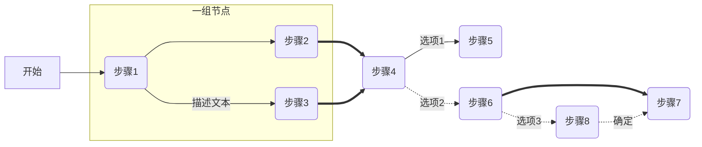
- 命令
```md
graph LR
    A[开始]-->B(步骤1)
    B---->C(步骤2)
    B--描述文本-->D(步骤3)
    C==>E(步骤4)
    D==>E
    E--选项1-->F(步骤5)
    E-.选项2.->G(步骤6)
    G==>H(步骤7)
    G-.选项3.->I(步骤8)
    I-.确定.->H
    
    subgraph 一组节点
        B
        C
        D
    end
```


- 这个流程图是一个从 A（开始）到 H（结束）的流程，其中包括以下箭头和括号的定义：
1.  `-->`：定义一个简单的向右箭头，表示从节点 A 到节点 B。
2.  `---->`：定义一个直线箭头，表示从节点 B 到节点 C。
3.  `-- 描述文本 -->`：定义一个带描述文本的双向箭头，表示从节点 B 到节点 D。
4.  `==>` ：定义一个粗箭头，表示从节点 C 到节点 E。
5.  `-.->`：定义一个带有点的线箭头，表示从节点 E 到节点 G。
6.  `-. 选项3 .->`：定义一个带有描述的线箭头，表示从节点 G 到节点 I，并使用花括号来表示选项描述。
7.  `-. 确定 .->`：定义一个带有描述的直线箭头，表示从节点 I 到节点 H，并使用括号来表示箭头的标签。


### 5.2.2 不同图形展示

- 示意图

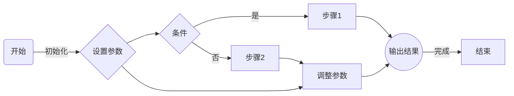

- 命令

```md
graph LR
    A[开始] -->|初始化| B(设置参数)
    B --> C{条件}
    C -->|是| D[步骤1]
    C -->|否| E[步骤2]
    B --> F(调整参数)
    E --> F
    D --> G((输出结果))
    F --> G
    G -->|完成| H[结束]
```

- 在这个示例中，我们定义了以下几种形状：

1.  `A(开始)`：定义一个圆角矩形节点，表示流程的开始。
2.  `B{设置参数}`：定义一个菱形节点，表示决策点。
3.  `C{条件}`：定义一个菱形节点，表示具有条件的决策点，并使用花括号来表示节点的形状。
4.  `D[步骤1]` 和 `E[步骤2]`：定义一个矩形节点，表示流程中的步骤。
5.  `F[调整参数]`：定义一个矩形节点，表示一个调整参数的步骤。
6.  `G((输出结果))`：定义一个圆形节点，表示流程中的结束点。
7.  `-->`：定义一个简单的向右箭头，表示单向箭头。
8.  `-->|描述文本|`：定义一个带有标签的箭头，表示从一个节点到另一个节点，同时附带关于箭头的描述信息。


### 5.2.3 步骤比较多

- 示意图

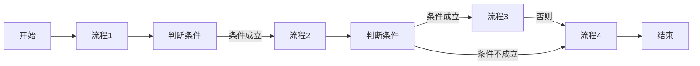

- 命令

```md
graph LR
    A[开始]-->B[流程1]
    B-->C[判断条件]
    C-->|条件成立|D[流程2]
    D-->E[判断条件]
    E--> |条件成立| F[流程3]
    F-->|否则|G[流程4]
    E-->|条件不成立|G[流程4]
    G-->H[结束]
```

- 命令解释
1.  `graph LR`：定义流程图的类型和布局。
2.  `-->`：定义节点间的流程顺序。
3.  `|文本|`：表示条件分支的判断条件和文本。
4.  `==>`：定义流程，表示在两个节点间连接一个带箭头的圆圈，圆圈中可以填写任何文本信息。
5.  `--文本-->`：定义带有文本的流程，用于表示带有文本标签的流程。
6.  `点击事件：点击A-->B：执行的函数`：定义点击事件，表示点击A节点时触发B节点的函数执行。

## 5.3 子图

**定义一个包含子图的流程图：**

- 示意图
    ```mermaid
    flowchart LR
        subgraph A
            物品-->B[计算1]
            B-->C(判断1)
            C-->|条件1| D[输出结果1]
            C-->|条件2| E[计算2]
            E-->D
        end

        subgraph B
            客户-->F[计算3]
            F-->G(判断2)
            G-->|条件3|H[输出结果2]
            G-->|条件4|I[计算4]
            I-->H
        end

        A-->B
        F-->C
    ```

- 命令
    ```md
        flowchart LR
            subgraph A
                物品-->B[计算1]
                B-->C(判断1)
                C-->|条件1| D[输出结果1]
                C-->|条件2| E[计算2]
                E-->D
            end

            subgraph B
                客户-->F[计算3]
                F-->G(判断2)
                G-->|条件3|H[输出结果2]
                G-->|条件4|I[计算4]
                I-->H
            end

            A-->B
            F-->C
    ```

- 命令解释

1.  `subgraph`：定义一个子图，可以用来分组和组织节点。
2.  `end`：标记子图的结束位置。
3.  可以在子图中使用标准的流程图语法定义节点、流程和条件分支。
4.  子图中的节点可以连接到主流程图中的其他节点。

## 5.2 其他图 


### 5.2.1 类图

- 示意图

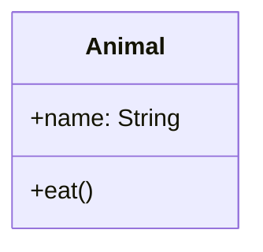

- 命令代码

```java
classDiagram
  class Animal {
    +name: String
    +eat()
  }
```

- 命令解释

1.  `classDiagram`：定义一个类图。
2.  `class`：定义一个类。
3.  `+` 或 `-`：表示类的公共或私有成员。
4.  `:`：定义成员的类型。
5.  `()`：定义一个方法。

### 5.2.2 状态图

**定义一个三种状态之间变化的状态图：**

- 示意图

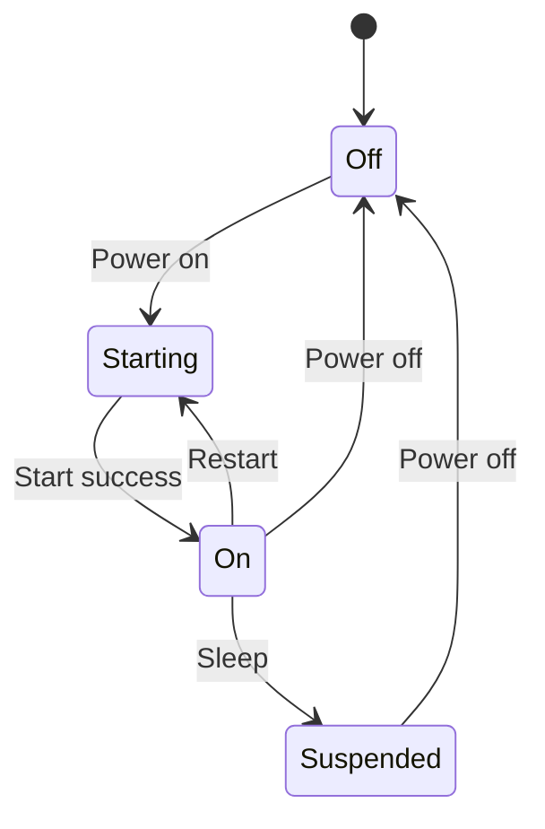

- 命令代码

```md
stateDiagram-v2
  [*] --> Off
  Off --> Starting : Power on
  Starting --> On : Start success
  On --> Off : Power off
  On --> Suspended : Sleep
  Suspended --> Off : Power off
  On --> Starting : Restart
```

- 命令解释

1.  `stateDiagram-v2`：定义状态图。
2.  `[*]`：表示默认起始状态。
3.  `-->`：表示状态变化。
4.  使用 `:` 标记每个状态的名称。
5.  可以使用`---`定义状态的展示文字。
6.  `:` 表示状态名称的展示文字。
7.  `extend` 可以用于表示某个状态的 `do` 动作。
8.  `note` 可以用于添加注释，例如在某个状态上添加状态详情信息等。

### 5.2.3 时序图

**定义一个简单的时序图：**

- 示意图

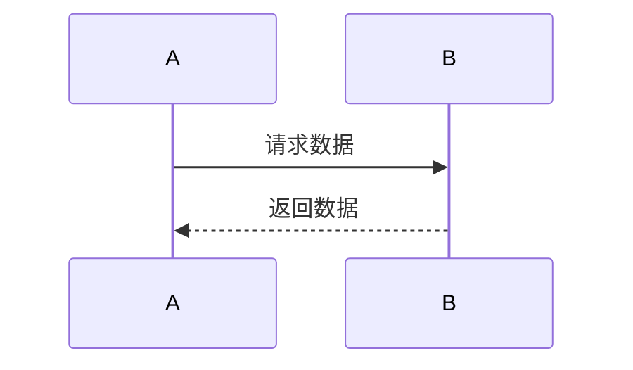

- 命令代码

```md
sequenceDiagram
  participant A
  participant B
  A ->> B : 请求数据
  B -->> A : 返回数据
```

- 命令解释（BABA请求数据返回数据）

1.  `sequenceDiagram`：定义时序图。
2.  `participant`：定义参与者的角色，可以在后面的流程步骤中使用它们。
3.  `->>`：表示请求操作。
4.  `-->>`：表示返回操作。
5.  `alt` 和 `else` 可以用于表示可选的分支。

### 5.2.4 甘特图

**定义一个简单的甘特图：**


- 示意图

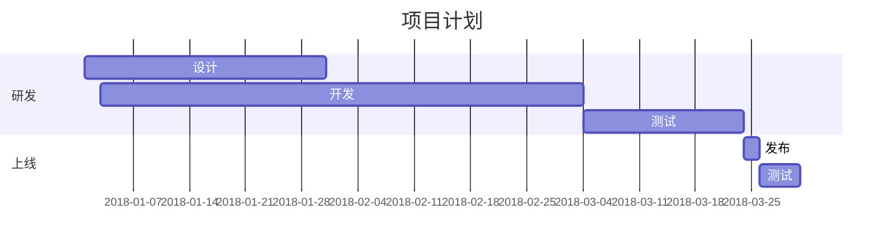

- 命令代码

```x86asm
gantt
  title 项目计划
  dateFormat  YYYY-MM-DD
  section 研发
  设计 :a1, 2018-01-01, 30d
  开发 :a2, 2018-01-03, 60d
  测试 :a3, after a2, 20d
  section 上线
  发布 :b1, after a3, 2d
  测试 :b2, after b1, 5d
```

- 命令解释

1.  `gantt`：定义甘特图。
2.  `title`：设置标题。
3.  `dateFormat`：定义日期格式。
4.  `section`：定义项目的不同阶段，可以在不同的阶段中设置相应的任务。
5.  使用 `:` 分隔任务名称和 ID。
6.  使用 `,` 分隔任务 ID、开始日期和持续天数。
7.  `after`：定义某个任务在另一个任务之后开始。
8.  根据起始时间和持续时间，可以计算出任务的结束时间。

### 5.2.5 树状图

**定义一个简单的树状图：**


- 示意图

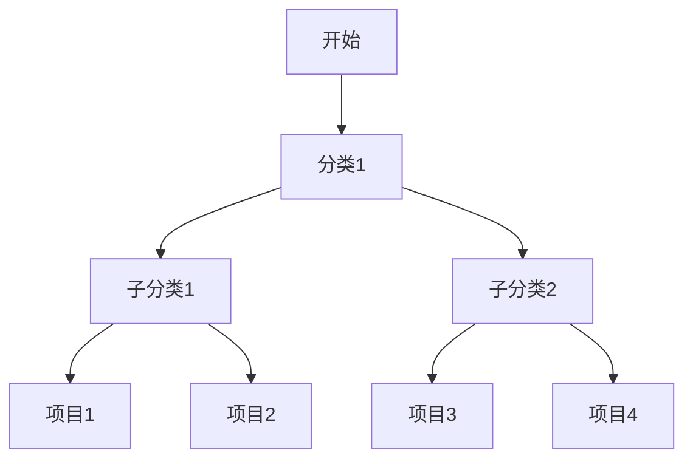

- 命令代码

```css
graph TD
  A[开始] --> B[分类1]
  B --> C[子分类1]
  B --> D[子分类2]
  C --> E[项目1]
  C --> F[项目2]
  D --> G[项目3]
  D --> H[项目4]
```
- 命令解释

1.  `graph TD`：定义树状图。
2.  使用`-->`连接父级和子级节点。
3.  树状图中的每个节点都代表一个分类或项目。
4.  树形结构可以包含任意数量的子树。

### 5.2.6 矩形图

**定义一个简单的矩形图：**

- 示意图

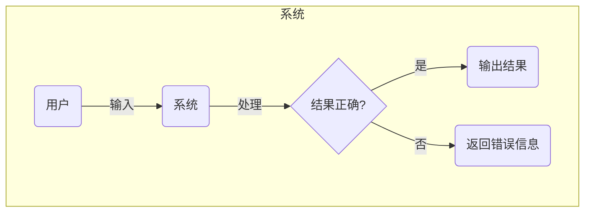

- 命令代码

```md
graph TD
  subgraph 系统
    A(用户) -- 输入 --> B(系统)
    B -- 处理 --> C{结果正确?}
    C -- 是 --> D(输出结果)
    C -- 否 --> E(返回错误信息)
  end
```

- 命令解释

1.  `graph TD`：定义矩形图。
2.  使用`--`连接节点。
3.  使用`()`定义节点类型。
4.  使用`{}`定义判断条件。
5.  使用`subgraph`和`end`来定义一个子集。

### 5.2.7 异步流程图

**定义一个简单的异步流程图：**

- 示意图

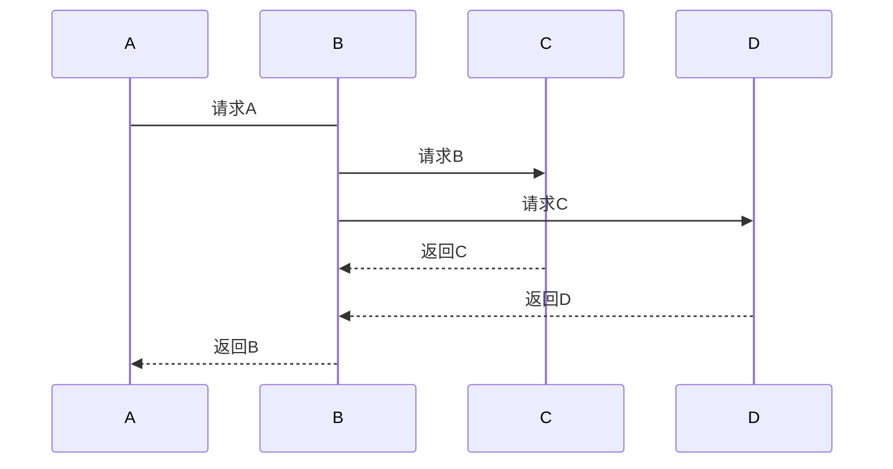

- 命令代码

```md
sequenceDiagram
  A->B: 请求A
  B->>C: 请求B
  B->>D: 请求C
  C-->>B: 返回C
  D-->>B: 返回D
  B-->>A: 返回B
```

- 命令解释

1.  `sequenceDiagram`：定义异步流程图。
2.  `->>`：表示异步请求。
3.  `-->>`：表示异步返回。
4.  使用 `:` 分隔消息名称和消息 ID。

### 流程图

**定义一个简单的流程图：**

- 示意图


- 命令代码

```md
flowchart TD
  A[开始] -->|条件1| B[流程1]
  B -->|条件2| C[流程2]
  C -->|条件3| D[流程3]
  D -->|条件4| E[结束]
```

- 命令解释

1.  `flowchart TD`：定义流程图。
2.  使用 `-->|文本|` 标记带有文本的流程，表示条件分支操作。
3.  使用细长菱形表示条件判断。

### 状态转换图

**定义一个简单的状态转换图：**

- 示意图

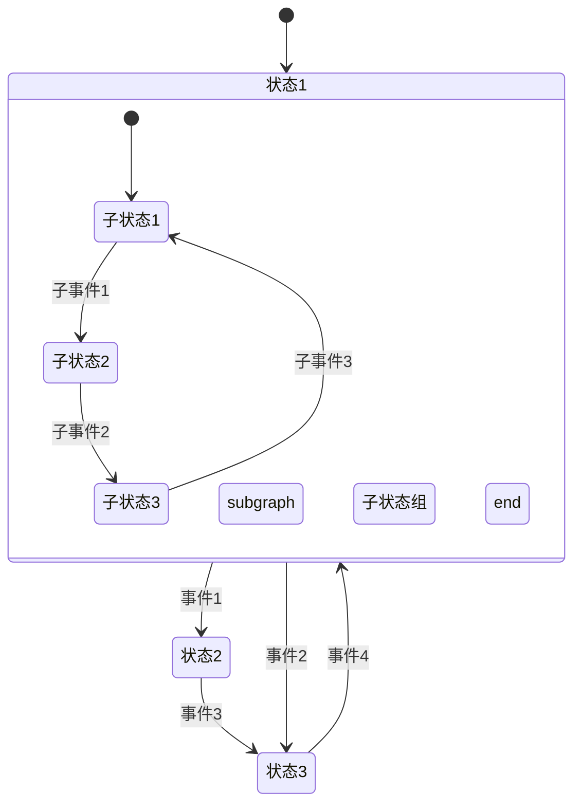

- 命令代码

```md
stateDiagram
  [*] --> 状态1
  状态1 --> 状态2 : 事件1
  状态1 --> 状态3 : 事件2
  状态2 --> 状态3 : 事件3
  状态3 --> 状态1 : 事件4
  state 状态1 {
    [*] --> 子状态1
    子状态1 --> 子状态2 : 子事件1
    subgraph 子状态组
      子状态2 --> 子状态3 : 子事件2
    end
    子状态3 --> 子状态1 : 子事件3
  }
```

- 命令解释

1.  `stateDiagram`：定义状态转换图。
2.  `[*]`：表示默认起始状态。
3.  `-->`：表示状态转换，用于表示状态之间的关系。
4.  `state`：可以用于定义一个新的状态域。
5.  `subgraph` 和 `end`：可以用来定义一个子状态组。
6.  使用 `,` 分隔状态名称和状态 ID。
7.  使用 `:` 分隔状态 ID 和展示名称。
8.  使用 `--->` 定义箭头的方向。

### 强调样式

**定义一个具有强调样式的流程图：**


- 示意图

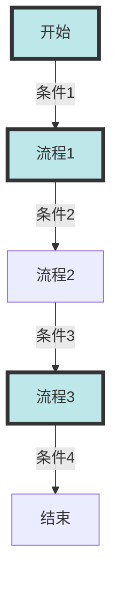

- 命令代码

```md
graph TD
  A[开始] -->|条件1| B[流程1]
  B -->|条件2| C[流程2]
  C -->|条件3| D[流程3]
  D -->|条件4| E[结束]
  style A fill:#BEE7E9,stroke:#333,stroke-width:4px
  style B fill:#BEE7E9,stroke:#333,stroke-width:4px
  style D fill:#BEE7E9,stroke:#333,stroke-width:4px
```

- 命令解释

1.  `style`：用于修改节点样式。
2.  `fill`：填充颜色。
3.  `stroke`：边框颜色。
4.  `stroke-width`：边框宽度。

### 字体样式

**定义一个具有自定义字体样式的流程图：**

- 示意图


- 命令代码

```md
graph TD
  A[开始] -->|条件1| B[流程1]
  B -->|条件2| C[流程2]
  C -->|条件3| D[流程3]
  D -->|条件4| E[结束]
  style A font-size:14px,fill:#BEE7E9,stroke:#333,stroke-width:4px
  style B font-size:14px,fill:#BEE79,stroke:#333,stroke-width:4px
```

- 命令解释

1.  `font-size`：定义节点的字体大小。
2.  `fill`：定义填充颜色。
3.  `stroke`：定义边框颜色。
4.  `stroke-width`：定义边框宽度。

### 样式继承

**定义一个具有样式继承的流程图：**

- 示意图


- 命令代码

```md
graph TD
  A[开始] -->|条件1| B[流程1]
  B -->|条件2| C[流程2]
  C -->|条件3| D[流程3]
  D -->|条件4| E[结束]
  style B extends A,fill:#BEE7E9,stroke:#333,stroke-width:4px
  style C extends B,fill:#E5D7D7
  style D extends B,fill:#E5D7D7
```

- 命令解释

1.  `extends`：用于定义节点的继承关系，使得一些节点可以继承其他节点的样式。
2.  `fill`：定义填充颜色。
3.  `stroke`：定义边框颜色。
4.  `stroke-width`：定义边框宽度。

### 自定义节点类型

**定义一个自定义节点类型的流程图：**

- 示意图

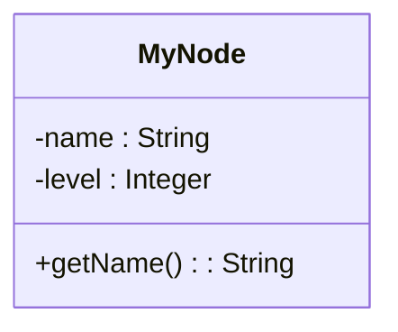

- 命令代码


```md
classDiagram
  class MyNode{
    -name : String
    -level : Integer
    +getName() : String
  }
```

- 命令解释

1.  `classDiagram`：定义一个类图。
2.  `class`：定义一个新的类或类型。
3.  `-`：定义一个私有属性。
4.  `+`：定义一个公共方法。
5.  使用 `:` 分隔属性和类型。
6.  使用 `()` 分隔方法名称和参数。

### 点击事件

**定义一个节点点击事件的流程图：**

- 示意图

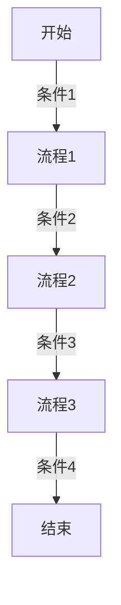

- 命令代码

```md
graph TD
  A[开始] -->|条件1| B[流程1]
  B -->|条件2| C[流程2]
  click C "alert('This is C node')" "点击C节点"
  C -->|条件3| D[流程3]
  D -->|条件4| E[结束]
```

- 命令解释

1.  `click`：定义节点的点击事件。
2.  `"alert(...)"`：执行的 JavaScript 代码。
3.  `"点击C节点"`：节点鼠标悬停标签。


### 容器

**定义一个具有容器的流程图：**

- 示意图

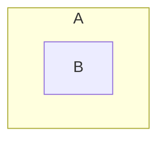

- 命令代码

```md
graph TB
  subgraph A
  B
  end
```

- 命令解释

1.  `subgraph`：定义一个容器。
2.  `end`：标记容器的结束位置。
3.  容器可以用来分组和组织节点，使它们易于管理。

### Git 图

**定义一个 Git 图：**

- 示意图


- 命令代码

```md
gantt
  title Git 进化史
  dateFormat YYYY-MM-DD
  section 远古时代
  创建 Git :a1, 2005-04-12, 15d
  section 现代化时代
  GitHub 购买 Git :a2, 2018-06-04, 1d
  section 近期时 
  Microsoft 收购 GitHub :a3, 2018-06-04, 1d
```

- 命令解释

1.  `title`：定义 Git 图的标题。
2.  `dateFormat`：定义日期格式。
3.  `section`：定义不同时间段。
4.  使用 `:` 分隔任务名称和 ID。
5.  使用 `,` 分隔任务 ID、开始日期和持续天数。

### 用户定义样式

**定义具有用户定义样式文件的流程图：**

- 示意图

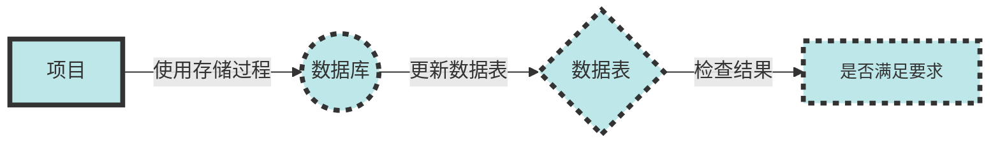

- 命令代码

```md
flowchart LR
  A[项目] -->|使用存储过程| B((数据库))
  B -->|更新数据表| C{数据表}
  C -->|检查结果| D[是否满足要求]
  style A fill:#BEE7E9,stroke:#333,stroke-width:4px
  style B fill:#BEE7E9,stroke:#333,stroke-width:4px,stroke-dasharray: 5, 5
  style C fill:#BEE7E9,stroke:#333,stroke-width:4px,stroke-dasharray: 5, 5
  style D fill:#BEE7E9,stroke:#333,stroke-width:4px,stroke-dasharray: 5, 5,font-size:14px
```

- 命令解释
1.  `style`：用于定义节点的样式。
2.  `fill`：表示填充颜色。
3.  `stroke`：指定边框颜色。
4.  `stroke-width`：指定边框宽度。
5.  `stroke-dasharray`：用于定义边框样式，该样式使用一组数字表示边框的线长度和间隔。
6.  `font-size`：用于定义节点标签的字体大小。

### 数字属性

**定义具有数字属性的流程图：**

- 示意图

```mermaid
graph LR
  A[顶部] ==>|50| B[中部]
  B <==>|25| C[底部]
```

- 命令代码

```md
graph LR
  A[顶部] ==>|50| B[中部]
  B <==>|25| C[底部]
```


- 命令解释

1.  `==> |数字|`：定义一个带数字属性的箭头。
2.  `<==>`：定义双向箭头。
3.  使用数字属性来定义箭头长度。

### 饼图

**定义一个饼图表：**

- 示意图

```mermaid
pie title 人员构成
  "工程师" : 43
  "销售" : 20
  "市场" : 17
  "其他" : 5
  "管理" : 15
```

- 命令代码

```md
pie title 人员构成
  "工程师" : 43
  "销售" : 20
  "市场" : 17
  "其他" : 5
  "管理" : 15
```

- 命令解释
1.  `pie`：定义饼图。
2.  `title`：定义饼图的标题。
3.  使用冒号分隔项目名称和数量。